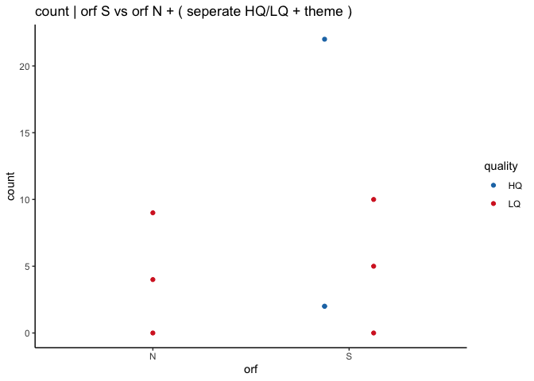
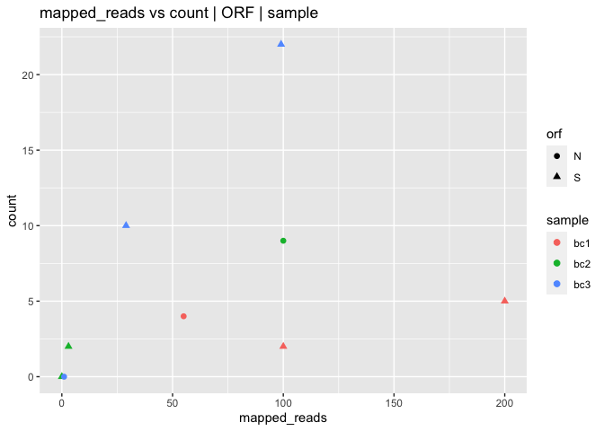
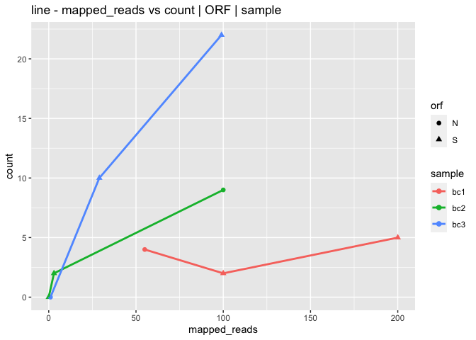
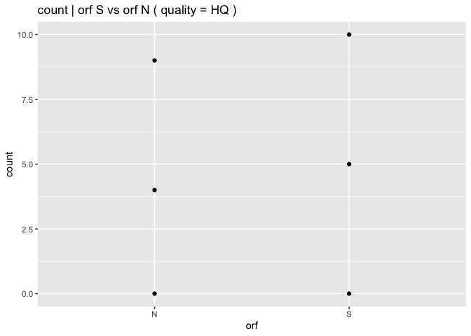
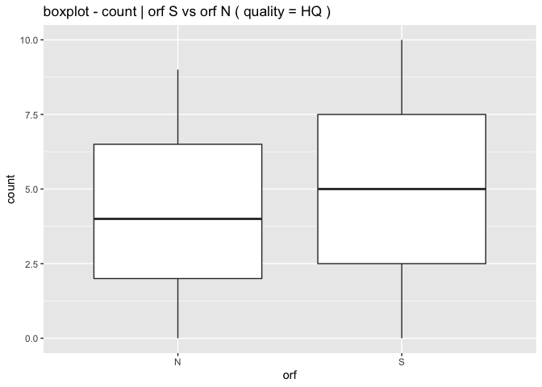

LIBRARY
=======

    require(ggplot2)
    require(tidyverse)

EXAMPLES
========

### batch read-in csv

    folder = "./example/"
    files  = list.files( folder, pattern = ".csv", full.names = TRUE )

    readin_csv = lapply( as.list( files ), 
                         function(x)
                         {
                           df0 = read.csv( x, header = TRUE, stringsAsFactors = FALSE )
                           
                           return( df0 )
                         } )

    df_csv = do.call( rbind, readin_csv )

    print(df_csv)

    ##   sample amplicon mapped_reads quality count orf
    ## 1    bc1        1          100      HQ     2   S
    ## 2    bc1        1          200      LQ     5   S
    ## 3    bc1        1           55      LQ     4   N
    ## 4    bc2        1            3      HQ     2   S
    ## 5    bc2        1            0      LQ     0   S
    ## 6    bc2        1          100      LQ     9   N
    ## 7    bc3        1           99      HQ    22   S
    ## 8    bc3        1           29      LQ    10   S
    ## 9    bc3        1            1      LQ     0   N

FIGURES
=======

    df_csv %>%
      ggplot() + 
      geom_point( aes( x = orf, y = count, color = quality ) ) + 
      scale_color_manual( values = c( "#1f77b4", "#d62728" ) ) + 
      ggtitle( "count | orf S vs orf N " )

<!-- -->

    df_csv %>%
      ggplot() + 
      geom_point( aes( x = orf, y = count, color = quality ), position=position_dodge(0.5) ) + 
      scale_color_manual( values = c( "#1f77b4", "#d62728" ) ) + 
      theme_classic() +
      ggtitle( "count | orf S vs orf N + ( seperate HQ/LQ + theme )" )

<!-- -->

    df_csv %>%
      ggplot() + 
      geom_point( aes( x = mapped_reads, y = count, color = sample, shape = orf ), size = 2 ) +
      ggtitle( "mapped_reads vs count | ORF | sample" )

<!-- -->

    df_csv %>%
      ggplot() + 
      geom_point( aes( x = mapped_reads, y = count, color = sample, shape = orf ), size = 2 ) +
      geom_line( aes( x = mapped_reads, y = count, color = sample, group = sample ), size = 1 ) +
      ggtitle( "line - mapped_reads vs count | ORF | sample" )

<!-- -->

    df_csv %>%
      filter( quality == "LQ" ) %>%
      ggplot() + 
      geom_point( aes( x = orf, y = count ) ) +
      ggtitle( "count | orf S vs orf N ( quality = HQ )" )

<!-- -->

    df_csv %>%
      filter( quality == "LQ" ) %>%
      ggplot() + 
      geom_boxplot( aes( x = orf, y = count ) ) +
      ggtitle( "boxplot - count | orf S vs orf N ( quality = HQ )" )

<!-- -->
