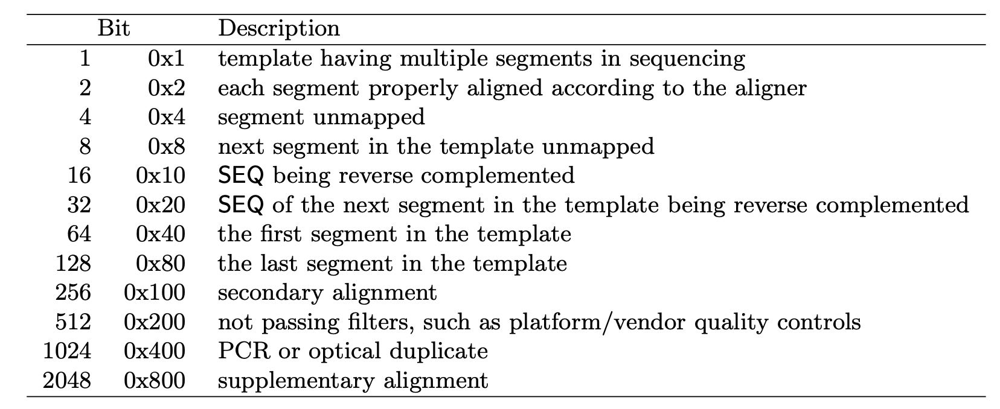

## BAM/SAM 


#### 1. How many (unique) reads in the .fq [1240]

```echo $(cat demulti/EXP-NBD196_barcode48.fastq|wc -l)/4 | bc``` or 

```nanoq -i demulti/EXP-NBD196_barcode48.fastq -s -t 5 -vvv```


#### 2. How many alignment records in the .bam/.sam [4877]

```samtools view -c barcode48_sorted_ev.bam``` or 

```cat barcode48_ev.sam | wc -l``` __-3__

* -3 to exclude the header section (lines that start with @ in the .sam file)


#### 3. Reads unmpped to the reference gene(s) [736]


```samtools view -f 0x4 -c barcode48_sorted_ev.bam```





#### 4. Identify the (unique) reads that map to reference gene(s) [504]

```samtools view -c -F 2308 barcode48_sorted_ev.bam```


* ```-F``` means exclude
*  __2308__ = 2048 (supplementary alignment) + 256 (secondary alignment) + 4 (segment unmapped)
	

#### 5. Secondary alignments [45]

```samtools view -f 256 -c barcode48_sorted_ev.bam```


* secondary alignments: a read aligns to multiple regions 


#### 6. Supplementary alignments [3592]

```samtools view -f 2048 -c barcode48_sorted_ev.bam```

* supplementary alignments: a read is split, each aligning to different regions


#### 7. Quick summery

```samtools flagstat barcode48_sorted_ev.bam```

~~~
4877 + 0 in total (QC-passed reads + QC-failed reads) 
1240 + 0 primary 
45 + 0 secondary 
3592 + 0 supplementary 
0 + 0 duplicates 
0 + 0 primary duplicates 
4141 + 0 mapped (84.91% : N/A) 
504 + 0 primary mapped (40.65% : N/A)
~~~


#### 8. Extract reads that map to both EV and human genomes

```
samtools view -F 2308 barcode48_sorted_ev.bam | grep -v '^@' - | cut -f1 | sort | uniq > virus_readID.txt

samtools view -F 2308 human.filtered.sam | grep -v '^@' - | cut -f1 | sort | uniq > human_readID.txt

comm -12 virus_readID.txt human_readID.txt  > both_readID.txt

subseq demulti/EXP-NBD196_barcode48.fastq both_readID.txt > both.fq

```

* _human.filtered.sam_ from `minimap2 -ax map-ont host/Homo_sapiens.GRCh38.cdna.all.fa.gz demulti/EXP-NBD196_barcode48.fastq -o human.filtered.sam` in the example
 


## References

1. Understanding the BAM flags [link](https://davetang.org/muse/2014/03/06/understanding-bam-flags/) 

2. Decoding SAM flags [link](http://broadinstitute.github.io/picard/explain-flags.html)

3. SAM format specification [pdf1](http://samtools.github.io/hts-specs/SAMv1.pdf); [pdf2](http://samtools.github.io/hts-specs/SAMtags.pdf) 